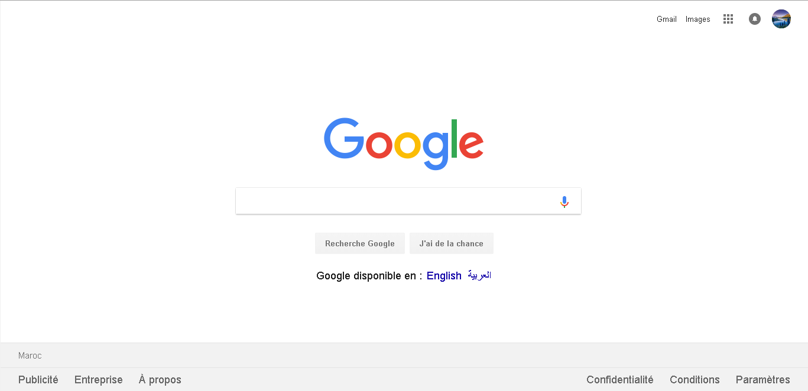

# Project0
This is my attempt to replicate a Google Home page using Html, Css and Bootstrap.
## objective
The main objective was the get my feet wet by creating something instead of just consuming tutorials or others lectures.

### The easy part - HTML
First I create the content of the page using unordered lists, then I grabbed the logo and images from the original home page, I also added the form and the content.

It's took less than our to get this part done.

### Linking Bootstrap
After that, I linked my html file to the Bootstrap Css link,
and start to put my code using the [grid system](https://getbootstrap.com/docs/4.0/layout/grid/) that allow us to organize the layout of the page.

```bash
<div class="container">
  <div class="row">
    <div class="col-sm">
      One of thwo columns
    </div>
    <div class="col-sm">
      One of three columns
    </div>
  </div>
</div>
```
This part was a little bit tricky, but it turn to be easy when you get understand it works.

The content of the page was embedded on 5 containers:
* The navbar on the top right Page
* The logo in the middle on the Page
* The input form and the mic icon
* The buttons and the text bellow them
* The foot who contains different links

### Css
This part took me more that 4h, to test and tweak, and compare with the original home Page using the Chrome Developer Tool.

### Results
This is the result I get:


On Chrome browser I get two issues:
* the border corner doesn't show up correctly on the account profile image
* the buttons stacks on each others


This is the screenshot of the original page:


### Update (no more stacking buttons)
After looking on the code, I just keep the two buttons on a single column in the middle of the row, I deleted the two others; the result was great: no more stacking.
